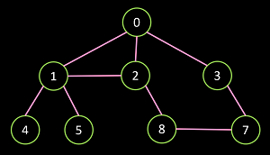

# Algoritmos em Grafos

Este projeto consiste em implementar e testar funções para carregar, salvar e gerar grafos, além de gerar subgrafos a partir da indicação dos vértices do grafo original.

## Correção e comentários

### Nota: 10,5 

Grafo de teste

---

- Carregar: não adiciona os vértices antes da aresta -> retorna grafo vazio
- Subgrafo não implementado
- DFS e BFS não implementados 
- Sem app

---

- Aderência às classes do diagrama: 2/2 pontos
- Requisitos de grafos corretamente implementados: 4,5/12 pontos
  - Carregar/salvar		1/2 pontos
  - Grafo completo e subgrafo 1,5/3 pontos
  - Grafo direcionado/não direcionado 2/2 pontos
  - Busca em largura e profundidade 0/4 pontos
  - App para uso 0/1 ponto
- Documentação de código: 2/4 pontos
  - parcial - frases básicas e nenhuma documentação de parâmetros
- Testes (quantidade e qualidade): 2/2 pontos
  - ok para o que foi implementado.

## Alunos integrantes da equipe

* Eric Rodrigues Diniz
* Luiz Felipe Vieira
* Gustavo Henrique dos Santos Riegert
* Paulo Roncarati de Souza
* Pedro Henrique Pessoa Cruz

## Professores responsáveis

* João Caram Santos de Oliveira
